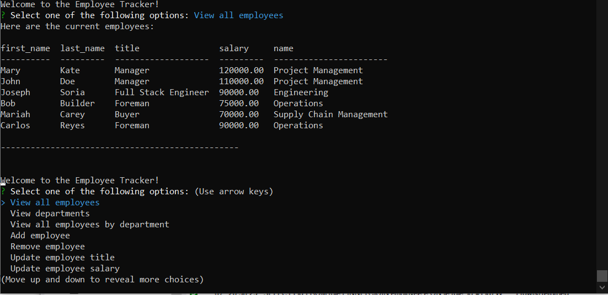
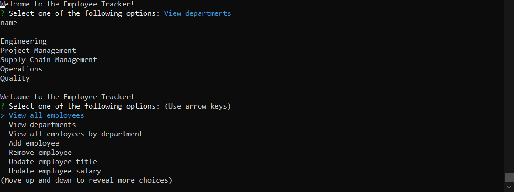
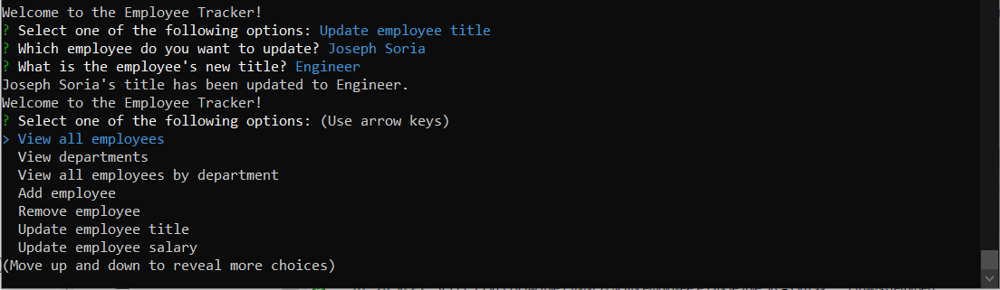
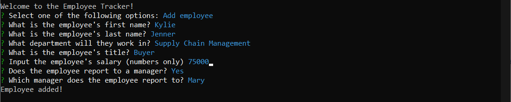

# CLIEmployeeTracker
A command line application that is used to store and read data on Employees.

## Link to Demonstration 

_https://drive.google.com/file/d/1ZKUnaO6HZ4JN5tiaHReqyVNv5ww5mktP/view?usp=sharing_

## Project Description

The purpose of this application is to use Node.js to connect to a MySQL Workbench server so that a user can store and read data from a database. Javascript (and some SQL) will be used to communicate between Node.js and MySQL by using the mysql2 module. This differs from my past projects due to the fact that the information isn't stored locally (using localstorage in Javascript).
## What to Expect From the Application

The user will be able to use this application to manage their employee's information, such as their name, ID, salary, title, and more! This information will be stored in a database as the user operates the app. Not only will the user write to the database, but they can also read and view the data entered.

This project is useful for companies across industries because data is always being handled and needing to be stored or modified. Using the CLIEmployeeTracker will allow the user to maintain this data in a neat and reliable fashion.

## Technologies

* Javascript
* Node.js
* MySql Workbench
* SQL
* Modularization
* Constructors
* OOP (Object-Oriented Programming)

## Packages

* Inquirer
* MySQL2
* Dotenv
* Console.table

# Installation Instructions

When cloning or forking this application, please pay attention to the .env.example file. This application uses the dotenv package so that private information can be stored since a password is required to connect to the MySQL server.

Use the following command to copy the env example file so you can replace the variable assignment in your .env file:

`cp .env.example .env`

# Tasks to Complete the Job :white_check_mark:

- [x] When the user invokes the application, they are present a menu of choices
- [x] The user will be able to view all employees in the database
- [x] The user will be able to view all departments in the database 
- [x] The user will be able to view all employees by department 
- [x] The user will be able add a new employee to the database
- [x] The user will be able remove an employee from the database
- [x] The user will be able to update the title and salary of an existing employee
- [x] The user will be able to exit the application and end the connection with the database

# Future Releases

* Add functionality to view employees by manager
* Add functionality to update an employee's manager
* Allow user to update salary and title using one option instead of two separate options
## Screenshots

